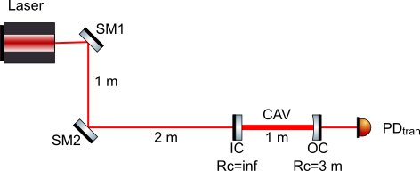
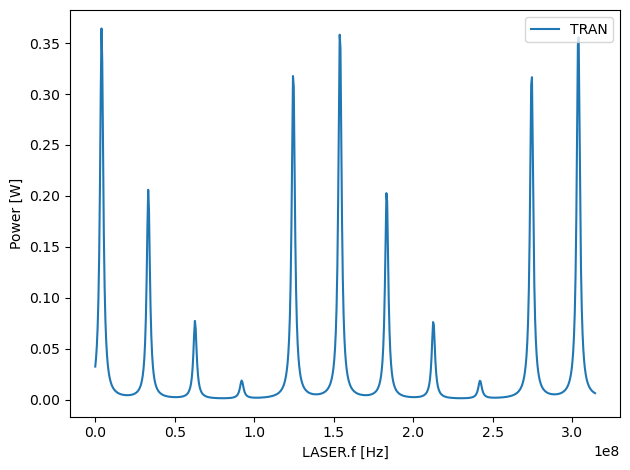
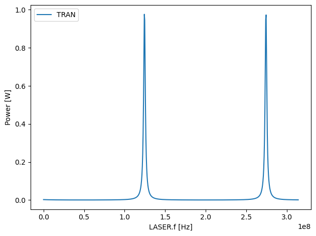
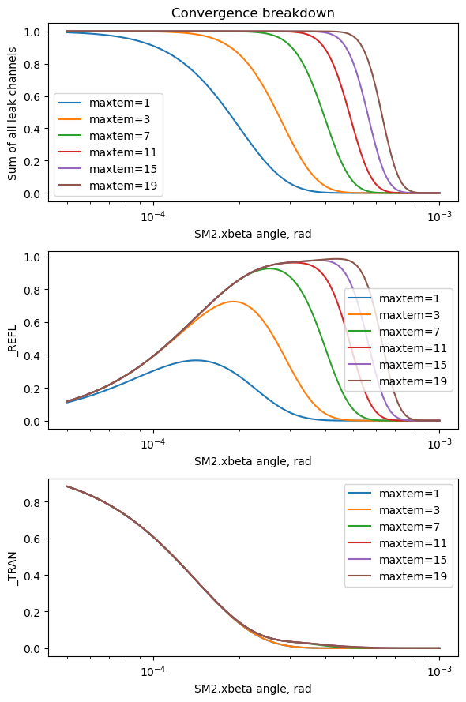
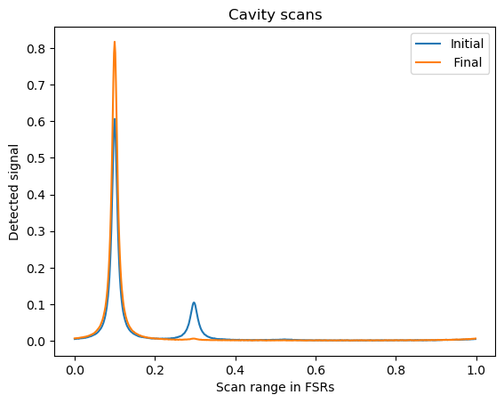
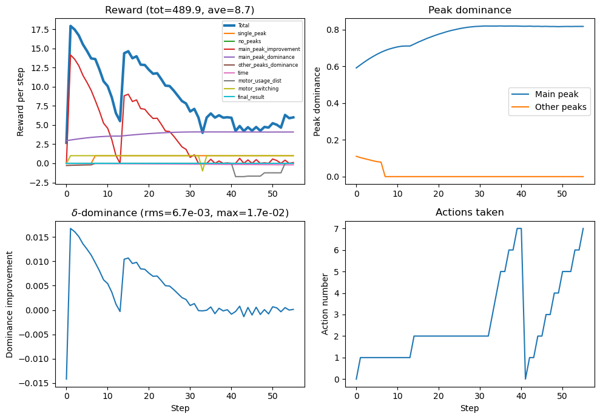

.. code:: ipython3

    import numpy as np
    import matplotlib.pyplot as plt
    import stable_baselines3
    
    import calmly

Example project notebook
========================

This notebook goes through the basic steps required to start using
``calmly`` to align an optical cavity with an agent trained by
reinforcement learning. This notebook is located in the
``example_project`` directory (``calmly_example.ipynb``) in the
``calmly`` repository.

To learn more about ``calmly``, please see:

-  `Repository <https://github.com/artemiy-dmitriev/calmly>`__
-  `Documentation <https://github.com/artemiy-dmitriev/calmly>`__
-  Python ``help()`` for methods included in ``calmly``.

The goal of this example project is to align a laser beam using two
steering mirrors to a simple two-mirror (Fabry-Perot) optical cavity
shown below.

|image1|

The pitch and yaw angles of steering mirrors SM1 and SM2 can be changed
by motorised actuators connected to the computer. The laser frequency is
periodically scanned through several free spectral ranges (FSRs) of the
cavity. The signal from the transmission PD (the cavity scan) is
recorded and passed to a special Python object, called *agent*, which
uses it to predict the next alignment step (i.e. which angular degree of
freedom of the steering mirrors to change and in which direction). The
alignment is then changed accordingly and the process is repeated until
a suitable alignment quality is achieved.

In principle, it is possible to set up the cavity in the lab and train
the agent directly on the physical system. However, it would usually
take a very long time. It is much easier to *simulate* the optical
system first. Calmly uses a Python interferometer simulation package
called `Finesse <https://finesse.ifosim.org/docs/latest/>`__ for that.
The typical workflow is as follows: 1. Create the model of the optical
setup in Finesse. 2. Prepare factory functions for the automated cavity
model creation and the procedure for preprocessing the cavity scans;
this will be used to provide input for the agent training. 3. Create a
dataset of alignment sequences for small initial misalignments using a
simple heuristic iterative alignment policy (either provided by
``calmly`` or custom). 4. Use this dataset to pre-train the agent with
`Behavioural Cloning
protocol <https://imitation.readthedocs.io/en/latest/algorithms/bc.html>`__
from the `imitation
package <https://imitation.readthedocs.io/en/latest/index.html>`__. It
provides a useful starting point for the reinforcement learning, which
could struggle with discovering the right alignment stratefy from
scratch if running in the completely unsupervised mode. 5. Use a
reinforcement learning algorithm to train the agent to improve the
alignment in more complicated cases. Currently, ``calmly`` is using the
`implementation <https://stable-baselines3.readthedocs.io/en/master/modules/ppo.html>`__
of the `PPO algorithm <https://arxiv.org/abs/1707.06347>`__ from the
`stable-baselines3 <https://stable-baselines3.readthedocs.io/en/master/index.html>`__
package. 6. Once the required performance level (monitored by tools
provided by ``calmly``) is achieved, proceed to the sim-to-real
transition and fine-tune the agent using the real setup.

Most of the configuration options for each project must be specified in
a configuration file (``calmly_config.yaml`` in the project directory by
default). The factory functions for step 2 are also provided in a
separate files (``my_factories.py`` in the project directory by
default). Feel free to use the files provided with this project as
templates!

The following command line utilities are installed with ``calmly`` and
can be used to perform steps 3-5 outside of a Python environment
(e.g. on an HPC cluster):

-  ``calmly-generate_dataset`` (create a dataset for imitation, see step
   3)
-  ``calmly-train_bc`` (pre-train the agent to imitate the actions from
   the dataset with behavioural cloning)
-  ``calmly-train_ppo`` (train the agent with the PPO reinforcement
   learning algorithm)
-  ``calmly-evaluate`` (evaluate the performance of an agent)
-  ``calmly-clean`` (clean up the project directory)

This document goes through the steps outlined above (except step 6 for
which the development is currently in progress in our lab) and provides
some additional information on other methods available in ``calmly``.

1. Simulating the cavity with ``calmly.simulator``
--------------------------------------------------

``calmly.simulator`` submodule works with Finesse interferometer models
and has the following features: - Simulates the process of aligning any
optical cavity to a laser beam with two steering mirrors - Works with
models of arbitrary cavities created in `Finesse
3 <https://finesse.ifosim.org/docs/latest/>`__. - Produces cavity scans
that can be used to teach reinforcement learning agents - ``Piezomotor``
class for simulating the action of piezoelectric stick-slip motors

We are going to use a special-case constructor for ``CavityAlignment``,
``calmly.CavityAlignment.two_mirror_cavity()``, which automatically
creates and stores the Finesse model of a two-mirror (Fabry-Perot)
cavity from the given parameters. It is possible to use the general
constructor ``calmly.CavityAlignment()`` instead in order to simulate
cavities represented by arbitrary custom Finesse models.

.. code:: ipython3

    cav_align = calmly.CavityAlignment.two_mirror_cavity(
        Lcav = 1.0,          # Cavity length IC<-->OC
        Rc = (np.inf, 3.0),  # RoCs of IC and OC
        Refl = (0.95, 0.95), # Reflection off IC and OC
        Loss = (0.0, 0.0),   # Internal loss in IC and OC
        StSp = (1.0, 2.0)    # Distances SM1<-->SM2 and SM2<-->IC
    )
    cav_align.set_maxtem(11) # Number of TEM modes to include in the simulation

Misaligning the input coupler by 300 urad and producing a cavity scan:
~~~~~~~~~~~~~~~~~~~~~~~~~~~~~~~~~~~~~~~~~~~~~~~~~~~~~~~~~~~~~~~~~~~~~~

We change the yaw angle of the input cavity mirror IC by
:math:`\alpha=3\times 10^{-4}` rad and take a cavity scan by changing
the laser frequency and looking at the DC readout of the photodetector
in transmission. Note that by default the ``.cavity_scan()`` method
changes the frequency over 2.1 free spectral ranges (FSRs) of the
optical cavity. This can be changed by passing a ``scan_range_in_fsrs``
parameter to ``.cavity_scan()``. See the help for this method for more
details.

.. code:: ipython3

    cav_align.m.IC.xbeta = 3e-4
    cav_align.cavity_scan(ppbw_resolution = 5, plot=True);

Compensating for the IC misalignment by turning steering mirror 2 by 150 urad:
~~~~~~~~~~~~~~~~~~~~~~~~~~~~~~~~~~~~~~~~~~~~~~~~~~~~~~~~~~~~~~~~~~~~~~~~~~~~~~

Since SM2 happens to be at the centre of curvature of the curved cavity
mirror OC, the misalignment we created by turning the plane input cavity
mirror IC by :math:`\alpha=3\times 10^{-4}` rad can be compensated for
by turning SM2 in the same direction by :math:`\alpha/2`. When we do
that, indeed only the TEM00 peaks remain visible in the cavity scan:

.. code:: ipython3

    cav_align.sm2.xbeta = 1.5e-4
    cav_align.cavity_scan(ppbw_resolution = 5, plot=True);

Convergence testing
~~~~~~~~~~~~~~~~~~~

Including a sufficient number of TEM modes is crucial for the simulation
to generate realistic cavity scans. There should be enough modes to
adequately describe the shifted and misaligned beams in a fixed TEM mode
basis. The convergence breaks down quickly when the misalignment angles
are increased.

The ``.get_convergence_curves()`` method misaligns a selected optical
component in the model to aid with selecting the right amount of TEM
modes. Note that the Finesse parameter ``maxtem`` selects the highest
*order* of TEM modes to be included, not the total number of modes
(i.e. ``maxtem=19`` will include 210 modes in total). Then the selected
detectors are plotted, e.g. in our example the first plot is the sum of
reflected and transmitted power by the cavity. When this value is not
close to 1, this means that the power is lost into unaccounted modes.
The plots show that the required amount of modes grows quickly with
increasing angles. Note, however, that the signal in transmission near
the resonance requires less modes to converge, since the calculation is
done in the cavity basis and the cavity is assumed to belocked to the
TEM00 mode, thus filtering the others.

.. code:: ipython3

    cav_align.m.IC.xbeta = 0
    cav_align.sm2.xbeta = 0
    
    cav_align.get_convergence_curves(axis = cav_align.sm2.xbeta,
                                     x = np.geomspace(5e-5,1e-3,100),
                                     maxtem_list = [1, 3, 7, 11, 15, 19],
                                     cavity_leak_channels = [cav_align.m.IC.p1.o, cav_align.m.OC.p2.o],
                                     leak_channel_names = ['_REFL', '_TRAN'],
                                     lock_to_mode=[0,0],
                                     plot = 'all',
                                     plot_logx = True
                                    );

.. parsed-literal::

    maxtem=1 calculation finished
    maxtem=3 calculation finished
    maxtem=7 calculation finished
    maxtem=11 calculation finished
    maxtem=15 calculation finished
    maxtem=19 calculation finished

Motors
~~~~~~

The model can simulate the effect of piezoelectric stick-slip motors
(e.g. the Picomotors) attached to the steering mirrors’ pitch and yaw
axes. Note that these motors typically have different calibration
coefficients (in units of rad/count) for the positive and negative
directions.

.. code:: ipython3

    # attaching identical motors to all alignment degrees of freedom
    cav_align.init_all_steering_motors(pos_coef=1.2e-6, neg_coef=0.9e-6, uncertainty=0.1)

Moving a motor forward and back by the same number of counts will not
restore the corresponding alignment angle:

.. code:: ipython3

    print(cav_align.dof_info(cav_align.sm2.xbeta))
    print("Moving SM2.xbeta motor by +100 counts")
    cav_align.move_steering_motor(cav_align.sm2.xbeta, 100)
    print(cav_align.dof_info(cav_align.sm2.xbeta))
    print("Moving SM2.xbeta motor by -100 counts")
    cav_align.move_steering_motor(cav_align.sm2.xbeta, -100)
    print(cav_align.dof_info(cav_align.sm2.xbeta))

.. parsed-literal::

    SM2.xbeta = 0.0 radians, motor pos = 0
    Moving SM2.xbeta motor by +100 counts
    SM2.xbeta = 0.00013624512472840816 radians, motor pos = 100
    Moving SM2.xbeta motor by -100 counts
    SM2.xbeta = 5.347689314500548e-05 radians, motor pos = 0

2. Prepare the factory functions for simulation and preprocessing of cavity scans
---------------------------------------------------------------------------------

We need to define the functions that would return the new copies of the
optical layout model and of the preprocessing algorithm (it will be used
by the trainer). This example project is supplied with the file
``my_factories.py`` which contains these functions:

.. code:: python

   def cav_sim_factory():
       maxtem = 3
       mis_angle_min=-2e-4
       mis_angle_max=2e-4

       cav_sim = CavityAlignment.two_mirror_cavity(
           Lcav = 1.0,          # Cavity length IC<-->OC
           Rc = (np.inf, 3.0),  # RoCs of IC and OC
           Refl = (0.95, 0.95), # Reflection off IC and OC
           Loss = (0.0, 0.0),   # Internal loss in IC and OC
           StSp = (2.0, 1.0)    # Distances SM1<-->SM2 and SM2<-->IC
       )
       cav_sim.set_maxtem(maxtem)
       
       cav_sim.add_misalignment_axes([
           cav_sim.m.IC.xbeta,
           cav_sim.m.IC.ybeta,
           cav_sim.m.OC.xbeta,
           cav_sim.m.OC.ybeta
       ], [mis_angle_min]*4, [mis_angle_max]*4)
       
       cav_sim.init_all_steering_motors(pos_coef=1.2e-6, neg_coef=1.0e-6, uncertainty=0, low_limit=-1000, high_limit=1000)
       return cav_sim

   def scan_processor_factory():
       signal_ref = None

       if signal_ref is None:
           signal_ref = cav_sim_factory().signal_ref
       return CavityScanPreProcess(signal_reference_level = signal_ref)

Alternatively, we could define this functions here in the notebook and
dump them to a file using ``pickle``:

.. code:: python

   import cloudpickle

   with open("my_factories.pkl", "wb") as f:
       cloudpickle.dump((cav_sim_factory, scan_processor_factory), f)

The stored factory methods can be loaded with
``calmly.load_factories()``:

.. code:: ipython3

    cav_sim_factory, scan_processor_factory = calmly.load_factories("my_factories.py")

The actual environment used to interact with the ML agents is based on
``gymnasium`` API (`see
here <https://gymnasium.farama.org/index.html>`__). Once the factory
functions are available, a factory function to generate the
``gymnasium`` environment can be obtained using
``calmly.get_env_factory()``:

.. code:: ipython3

    # Creating a factory function for the gymnasium environment
    create_env = calmly.get_env_factory(
        cav_sim_factory=cav_sim_factory,
        scan_processor_factory=scan_processor_factory,
        monitor=False,
        training=False,
        mis_angle_min=-2.0e-4,
        mis_angle_max=2.0e-4,
        seed=0
    )

Factory functions are widely used in machine learning packages such as
``stable-baselines3`` to provide data for the model training based on
reinforcement learning. They can be used to produce `vectorised
environments <https://stable-baselines3.readthedocs.io/en/master/guide/vec_envs.html>`__
for parallel computing in ``stable-baselines3``, e.g. using
``SubprocVecEnv``, which is used by ``calmly`` to speed up the learning.

In the code block below, we use an environment created with
``create_env()`` in an attempt to align the originally misaligned cavity
using a simple heuristic protocol ``calmly.policies.iterative_policy()``
which is included in ``calmly``. This protocol mimics the standard lab
approach to the cavity alignment: improving it with each available DoF
consecutively and then repeating this procedure iteratively until the
desired alignment precision is achieved. This protocol usually works
quite well for small initial misalignments.

.. code:: ipython3

    test_env = create_env()
    out = calmly.simulate_episode_with_trained_model(
        calmly.policies.iterative_policy,
        test_env,
        Nsteps_to_print_after=20
    )

.. parsed-literal::

    step: 20 	rew: 12.83880120215835 	dom: 0.7683043729016023 	ddom: 0.008351512643112624 	Npeaks: 1
    step: 40 	rew: 6.014035461709104 	dom: 0.8200080270997326 	ddom: 6.357006199408932e-05 	Npeaks: 1
    Total Episode Reward: 803.8159751170291
    Finished as Terminated after 57 steps
    Final dominance of the main peak: 0.8169415176106778

The code below will output the cavity scans for initial and final
alignment plus additional metrics for visual evaluation of the
performance: total reward and its important components on every step,
“dominance” (relative peak height by default) of the main peak and of
other peaks, “:math:`\delta`-dominance” (change in dominance after the
last step), and the number of the action taken, according to the
following map:

.. code:: python

   class Actions_1(Enum):
       DECREASE_SM1_YAW = 0
       INCREASE_SM1_YAW = 1
       DECREASE_SM1_PITCH = 2
       INCREASE_SM1_PITCH = 3
       DECREASE_SM2_YAW = 4
       INCREASE_SM2_YAW = 5
       DECREASE_SM2_PITCH = 6
       INCREASE_SM2_PITCH = 7

(class ``Actions_1`` is available from ``calmly.env`` for convenience).

.. code:: ipython3

    out.plot_cavity_scans();
    out.plot_metrics(step_highlim=-1);

Manual alignment
~~~~~~~~~~~~~~~~

It is possible to use the gym environment factory to align the simulated
misaligned cavity manually. In order to do this, first we need to
initialise the manual alignment in the following way:

.. code:: ipython3

    test_env = create_env()
    diag = calmly.manual_episode_init(test_env)

Once initialised, the cavity can be aligned by the user step-by-step by
calling ``calmly.manual_episode_step()`` at each alignment step:

.. code:: ipython3

    calmly.manual_episode_step(test_env, diag, action=None)

The parameter ``action`` should be an integer representing the action
number or ``None`` to just print out the current alignment information.
This information is stored in ``diag`` and can be visualised (e.g. once
the alignment process is complete) using ``diag.plot_cavity_scans()``
and ``diag.plot_metrics()`` as above.

3. Use a simple heuristic policy to create a training dataset
-------------------------------------------------------------

We are going to use ``iterative_policy()`` which we already used above
to record a small dataset of alignment ‘episodes’ to be used in
imitation learning at the next step.

Configuration file for ``calmly`` (``calmly_config.yaml``)
~~~~~~~~~~~~~~~~~~~~~~~~~~~~~~~~~~~~~~~~~~~~~~~~~~~~~~~~~~

The actions performed on steps 3-5 are mostly configured via the
``calmly`` configuration file, which is called ``calmly_config.yaml`` by
default (this can be overriden by passing the argument ``config=`` to
the methods from ``calmly.actions``). A copy of ``calmly_config.yaml``
is included in this project and can be used as a template. It is
sectioned into parts representing different actions:

.. code:: yaml

   # User factory definition module (must define cav_sim_factory and scan_processor_factory)
   factories:
     module: "my_factories.py"  # User-defined Python file containing the factory functions

   # Heuristic dataset generation
   dataset:
     enabled: true
     quiet: false
     n_episodes: 200
     path: "data/heuristic_dataset.pkl"
     n_peaks: 5
     maxtem: 5
     mis_angle_min: -2.0e-4 
     mis_angle_max: 2.0e-4
     policy: "default" # or a pickle path
     seed: 42

   # Behavioral Cloning
   bc:
     enabled: true
     quiet: false
     policy_save_path: "models/bc_policy.pt"
     torch_num_threads: 10
     n_envs: 4
     device: "mps"
     net_arch: [64, 64]
     learning_rate: 1e-4
     n_epochs: 10
     seed: 142

   # PPO Fine-Tuning
   ppo:
     enabled: true
     quiet: false
     continue_training: false
     skip_bc: false
     device: "cpu"
     n_envs: 10
     torch_num_threads: 1
     learning_rate: 3e-4
     total_timesteps: 400000
     ent_coef: 0.02
     exploration_settings:
       enabled: true
     tensorboard_log: "logs/ppo"
     save_path: "models/ppo_policy"
     n_peaks: 5
     maxtem: 5
     mis_angle_min: -4.0e-4 
     mis_angle_max: 4.0e-4
     seed: 242
     
   # Evaluation
   evaluation:
     enabled: true
     quiet: false
     n_episodes: 20
     agent_path: "models/bc_policy.pt"
     n_peaks: 5
     maxtem: 5
     mis_angle_min: -4.0e-4 
     mis_angle_max: 4.0e-4
     seed: 342
     save_path: "evaluation/evaluation_results.yaml"

With this file in place, we can simply record the training dataset and
save it at ``data/heuristic_dataset.pkl`` by calling
``calmly.actions.generate_dataset()`` (or ``calmly-generate_dataset`` in
the terminal).

Note: the cell below will produce a dataset with 200 episodes. This
might take some time to compute. A pre-recorded copy is already
available at ``data/heuristic_dataset.pkl``.

.. code:: ipython3

    # Takes approx. 33 minutes on a 2023 Apple M3 MBP
    calmly.actions.generate_dataset()

4. Pretrain the agent using behavioural cloning with the recorded dataset.
--------------------------------------------------------------------------

This step takes advantage of the dataset we recorded previously to show
the agent some examples of the “winning” alignment strategy, which
otherwise it might take too long to discover. With the parameters
specified in ``calmly_config.yaml``, we can run the following cell to
train an agent with behavioral cloning (BC) for 10 epochs and store the
result to ``models/bc_policy.pt`` in the form of a PPO-compatible policy
(to be loaded in the PPO model at the next step). Again, a pre-recorded
copy is already included in the distribution.

.. code:: ipython3

    # Takes approx. 1 minute on a 2023 Apple M3 MBP
    calmly.actions.train_bc_model()

5. Train the PPO agent.
-----------------------

PPO stands for “`proximal policy
optimisation <https://stable-baselines3.readthedocs.io/en/master/modules/ppo.html>`__”,
a powerful policy gradient algorithm for reinforcement learning. In this
example, we are going to use it for a wider range of initial
misalignment angles to extend the range of policy trained by the simple
heuristic algorithm. The following will store the resulting PPO model in
``models/ppo_policy.zip`` (a pre-recorded copy is included).

.. code:: ipython3

    # Takes approx. 27 minutes on a 2023 Apple M3 MBP
    calmly.actions.train_ppo_model()

6. Evaluate the agent performance
---------------------------------

We already described above a method,
``calmly.simulate_episode_with_trained_model()``, which allows for
running a single ‘episode’ of aligning a misaligned cavity using a
trained model or a policy algorithm. A more general approach to the
evaluation is to use ``calmly.actions.evaluate_model()`` (or its
command-line script, ``calmly-evaluate``). It collects performance data
for several episodes using settings from the ``evaluation`` section of
the project config file (``calmly_config.yaml`` by default) and stores
the results in another YAML file.

